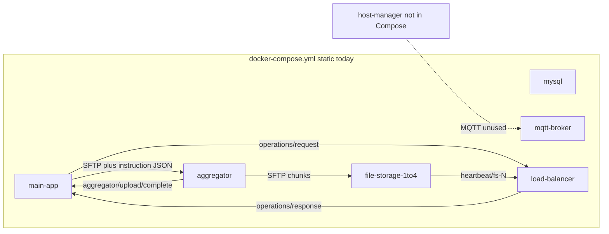

# Current state (Phase 0 baseline)

Inspection date: 2026-09-09. Functional Java and Compose behaviour is unchanged except Git hygiene (`.gitignore`, untracking generated/K8s artefacts). Later brief items (config contract, `filemanager/` MQTT topics, Minikube Compose, HostManager bootstrap) are out of scope for this snapshot.

There is **no parent POM** and **no multi-module aggregator**. Five independent Maven projects, all `com.example`, Java 21, `1.0-SNAPSHOT`.

## 1. Module and service inventory

| Module | POM | Entry point | Runtime role today |
|---|---|---|---|
| [main-app](../main-app/pom.xml) | `com.example:main-app` | `com.example.mainapp.App` (JavaFX). JAR plugin incorrectly names `com.example.mainapp.Main` (class does not exist). | GUI, SQLite cache, MySQL metadata, MQTT upload/download/delete, offline sync |
| [load-balancer](../load-balancer/pom.xml) | `com.example:load-balancer` | `com.example.loadbalancer.LoadBalancerApp` | MQTT `operations/request`, hardcoded routing, delete coordination, heartbeat monitor |
| [aggregator](../aggregator/pom.xml) | `com.example:aggregator` | `com.example.aggregator.AggregatorApp` | SFTP server + **directory polling** for instruction JSON; chunk/encrypt/SFTP; heartbeats |
| [file-storage](../file-storage/pom.xml) | `com.example:file-storage` | `com.example.filestorage.FileStorageApp` | SFTP chunk store, MQTT delete, heartbeats |
| [host-manager](../host-manager/pom.xml) | `com.example:host-manager` | `com.example.hostmanager.HostManagerMain` | ProcessBuilder Docker helpers exist; **MQTT scale loop is commented out**; **not in Compose** |

Supporting (not Maven): [`config/mysql-init.sql`](../config/mysql-init.sql), [`config/mosquitto.conf`](../config/mosquitto.conf), [`docker-compose.yml`](../docker-compose.yml).

**main-app packages:** `App`; controllers (Login, Register, Main, Users, EventLogs, UpdatePassword); `db` (LocalSQLite, RemoteMySQL, DatabaseInitializer); repositories; services (Auth, File, Sync*, Connectivity, Session*); MQTT managers; SFTP client; logging; models; FXML under `src/main/resources`.

**load-balancer:** MQTT (`MqttBroker`, `MqttMessageHandler`, `TopicPublisher`); `RoutingService`, `HealthMonitor`, `DeleteCoordinator`; models `AggregatorInfo`, `FSContainerInfo`.

**aggregator:** `MqttBroker` + `MqttMessageHandler` (file watcher, not MQTT subscribe for ops); `UploadHandler`, `DownloadHandler`, `ChunkService`, `EncryptionService`, `HealthReporter`; SFTP server/client.

**file-storage:** `MqttBroker` + delete handler; `StorageService`, `ChunkManager`, `HealthReporter`; SFTP server.

**host-manager:** `HostManager` (ProcessBuilder), `ContainerOrchestrator` (scale 4 FS / 1 agg), unused `host-manager/.../mqtt/MqttClient.java`.

## 2. Docker, scripts, tests currently present

| Asset | Status |
|---|---|
| Dockerfiles / `.dockerignore` | **None** |
| Compose | [`docker-compose.yml`](../docker-compose.yml) only. **No** `docker-compose.minikube.yml` |
| Shell / PowerShell / Makefiles | **None** (`scripts/` absent) |
| Test directories | **None** — zero `src/test` trees, zero test classes |
| JUnit on classpath | Only [`main-app/pom.xml`](../main-app/pom.xml) (`junit-jupiter-api` 5.10.0, test scope). Other modules: no JUnit |
| Kubernetes | Previously tracked under `k8s/`; **removed from the tree** in Phase 0 (not recreated) |

Compose starts: mysql, mqtt-broker, main-app (`pedrombmachado/ntu_lubuntu:soft40051`, source mount `./main-app:/app/data`), load-balancer / aggregator / four file-storage services as **`maven:3.9.6-eclipse-temurin-22` with `mvn clean compile && mvn exec:java` at startup**. Network `filemanager-network`. Volumes: mysql-data, mqtt-data, aggregator-data, storage-volume-1–4, maven-repo. **host-manager is not a Compose service.** Gitea is commented out.

## 3. Hardcoded credentials, keys, hosts, ports, topics, IDs, paths

### Credentials / secrets

- Compose MySQL: `MYSQL_ROOT_PASSWORD: root123`, `MYSQL_USER: fileapp`, `MYSQL_PASSWORD: fileapp123`, DB `filemanager`.
- `RemoteMySQLDataSource`: env with fallbacks `filemanager-mysql` / `3306` / `filemanager` / `fileapp` / **`fileapp123`**. Commented legacy: `root` / `MySQL$Password1` / `localhost:3306/fileapp`.
- `config/mysql-init.sql`: seed user `admin` / documented password **`admin123`** (BCrypt hash in file).
- `DatabaseInitializer.initializeRemoteDatabase`: seeds `test`/`admin` with hashes of plaintext `"test"` / `"admin"` (method **not called**; commented in `App`).
- SFTP client: aggregator `UploadHandler` / `DownloadHandler` use **`"user"` / `"password"`**.
- SFTP servers: aggregator and file-storage `SftpUserInfo` **accept any username/password**.
- AES key: `EncryptionService.getHardcodedKey()` — `"12345678901234567890123456789012"` (32 ASCII bytes).
- Mosquitto: `allow_anonymous true` (`config/mosquitto.conf`).

### Hosts / ports

- MQTT default everywhere: `tcp://filemanager-mqtt:1883`.
- Compose publishes `3307:3306`, `1883:1883`, `9001:9001`, main-app `3390:3389` and `2022:22`.
- Aggregator SFTP default **2222**; FS Compose `SFTP_PORT` **2201–2204**; HostManager maps host port to container **`:2222`**.
- `RoutingService`: aggregator hostname `aggregator` port 2222; FS hostnames `file-storage-1..4` ports 2201–2204.
- Compose `STORAGE_PORT` 8082–8085: **unused in Java**.
- HostManager scale ports: FS base **3000**, aggregator base **4000**.

### Application / container IDs

- Compose: `MAIN_APP_ID: main-app-1`, `AGGREGATOR_ID: agg-1`, `FS_CONTAINER_ID: fs-1..4`, also unused `CONTAINER_ID: storage-N`.
- Java defaults: `agg-1`, `fs-1`, HostManager `hm-1`, LB MQTT client id `load-balancer`.
- LB registers `fs-1..4`, `agg-1`. TopicPublisher fallback delete IDs `fs-1..4`.
- **Bug vs Compose:** `LoginController` and `MainController` ignore `MAIN_APP_ID` and use `"main-app-" + System.currentTimeMillis()`.
- Aggregator completion fallback **`main-app-1`** if instructions omit `mainAppId`.

### MQTT topics (actual, not brief `filemanager/` prefix)

| Topic | Use |
|---|---|
| `operations/request` | Main app → LB |
| `operations/response/{mainAppId}` | LB → main app |
| `aggregator/upload/complete/{mainAppId}` | Aggregator → main app |
| `aggregator/download/complete/{mainAppId}` | Aggregator → main app |
| `fs/delete/{fsId}` | LB → storage |
| `fs/delete/response` | Storage → LB |
| `heartbeat/{id}` | FS/aggregator heartbeats; LB `heartbeat/#` |
| HostManager **planned but unused** | `hostmanager/scale/fs/up\|down`, `hostmanager/scale/aggregator/up\|down`, `hostmanager/status` (+ `/response`) |

No `filemanager/` prefix. Aggregator ops are **not** MQTT-driven; they poll `instructions*.json` / `retrieval_instructions*.json`.

### Storage / work paths

- SQLite: `SQLITE_DB_PATH` or `fileapp.db`; Compose `/app/data/fileapp.db` with volume `./main-app:/app/data`.
- Aggregator: `WORKING_DIR` or `/data/working`; Compose `/app/data`.
- File storage: `STORAGE_BASE_PATH` or `/data/volume-group-{n}/chunks`. Compose mounts **`/storage/data`** and **does not set `STORAGE_BASE_PATH`** (chunks likely not on named volumes).
- HostManager: `/var/filemanager/volumes/volume{n}/{name}`, `/var/filemanager/aggregator/{name}`, image names `file-storage:latest` / `aggregator:latest`, volume mount `/data/volume`.
- Images: Compose uses Maven/Lubuntu images, not `file-manager/*:latest`.

## 4. Subsystem status

### MySQL initialisation — **partial**

- Compose mounts **only** `config/mysql-init.sql` → `/docker-entrypoint-initdb.d/init.sql` (runs **once** on empty volume).
- Script: `CREATE DATABASE IF NOT EXISTS`, tables `users`, `files`, `file_chunks`, `file_permissions`, `event_logs` with FKs/indexes; idempotent `CREATE TABLE IF NOT EXISTS`; admin seed `ON DUPLICATE KEY`. **No** `containers` / sync tables.
- Java `DatabaseInitializer.initializeRemoteDatabase()` only verifies connectivity; schema ownership remains with `config/mysql-init.sql`.
- MySQL healthcheck in Compose is **commented out**. App passwords are hashed (BCrypt); seed is a known demo password.

### SQLite initialisation — **idempotent local foundation**

- `LocalSQLiteDataSource`: authoritative idempotent `IF NOT EXISTS` schema for `user_sessions`, `cached_files`, `cached_users`, `cached_permissions`, and `pending_changes`; WAL; configured path; creates parent directories.
- `DatabaseInitializer.initializeLocalDatabase()` delegates to `LocalSQLiteDataSource`; sessions reference `cached_users(user_id)`.
- Missing vs brief: dedicated session/cache tables as specified, local events, sync metadata status beyond simple `pending_changes`. **No tests.**

### MQTT communication — **partial, non-standard topics**

- Paho clients in all modules except HostManager (client exists, **never connected**).
- LB subscribes `operations/request` and `fs/delete/response`; publishes routing/delete.
- Main app request/wait on `operations/response/{id}` and aggregator complete topics.
- Aggregator **does not subscribe** to upload/download/delete MQTT; file polling every 2s.
- QoS: publish typically default; subscribe QoS 1 in some clients. No shared DTO validation layer. Callbacks do work inline (delete wait 30s on MQTT thread).

### HostManager ProcessBuilder / Docker — **code present, unused at runtime**

- `HostManager`: argument-array `docker run/rm/ps/inspect/--version` (not shell-concatenated).
- Missing vs brief: `--network filemanager-network`, managed labels, `FS_CONTAINER_ID`, named Compose volumes, env contract, stderr/timing events.
- `HostManagerMain` **exits if Docker missing**, then **keepAlive with MQTT commented**. Not in Compose; no Docker socket story.

### Dynamic container bootstrap/scaling — **not operational**

- `ContainerOrchestrator`: scale up/down 4 FS + 1 agg; in-memory map only; MQTT registry TODOs.
- **No startup discovery / baseline bootstrap** of 1 agg + VG1–4.
- LB **never publishes scale topics**.
- Dynamic services are **statically declared** in Compose and compile with Maven at container start.

### Health monitoring — **heartbeat only; no self-heal**

- FS/aggregator `HealthReporter`: every 10s on `heartbeat/{id}`.
- `HealthMonitor`: 30s offline; HEALTHY/OFFLINE only (no DEGRADED, no `/health` HTTP).
- Routing **prefers** healthy FS then **falls back to offline**. Aggregator selection **ignores** health.
- No HostManager recovery/replace.

### Upload / download / delete — **implemented end-to-end in code; several integration gaps**

- Upload: Main `UploadManager` → LB routing → SFTP file+instructions to aggregator → split 4 / AES / CRC32 / SFTP to FS → MQTT complete → MySQL chunk metadata.
- Download: inverse via `retrieval_instructions` polling.
- Delete: LB `DeleteCoordinator` + `fs/delete/{id}`; latch keyed by `fileId` only (concurrency risk).
- Gaps: hardcoded SFTP/AES; path/port/ID mismatches; instruction-file polling; `MAIN_APP_ID` not used; Maven-at-startup; no binary/hash tests.

### Test coverage — **none**

- No `src/test`. Maven `test` is expected to report **no tests** (or skip) per module. Only main-app declares JUnit API.
- `main-app/pom.xml` `maven-jar-plugin` mainClass `com.example.mainapp.Main` is wrong. **Not fixed in Phase 0** (does not block `compile`).

## 5. Maven compile and test (Phase 0 run)

Recorded 2026-09-09T17:43–17:44 +01:00.

- Java: **25** (`Java(TM) SE Runtime Environment (build 25+37-LTS-3491)`). POMs compile with `javac` **target 21**.
- Maven: **3.9.11** (`C:\Program Files\apache-maven-3.9.11`)
- Host: Windows 11, `amd64`
- Commands (per module): `mvn -f <module>/pom.xml compile` then `mvn -f <module>/pom.xml test`

| Module | `compile` | `test` |
|---|---|---|
| main-app | **BUILD SUCCESS** (exit 0). Compiled 43 source files. Warnings: JavaFX effective-model problems; `mysql:mysql-connector-java` relocated to `com.mysql:mysql-connector-j`; system modules not set with `-source 21` (`--release 21` recommended). | **BUILD SUCCESS** (exit 0). `No sources to compile` (testCompile). Surefire: **No tests to run.** |
| load-balancer | **BUILD SUCCESS** (exit 0). Classes already up to date. | **BUILD SUCCESS** (exit 0). `No sources to compile`. Surefire: **No tests to run.** |
| aggregator | **BUILD SUCCESS** (exit 0). Classes already up to date. | **BUILD SUCCESS** (exit 0). `No sources to compile`. Surefire: **No tests to run.** |
| file-storage | **BUILD SUCCESS** (exit 0). Classes already up to date. | **BUILD SUCCESS** (exit 0). `No sources to compile`. Surefire: **No tests to run.** |
| host-manager | **BUILD SUCCESS** (exit 0). Compiled 4 source files. Warning: system modules not set with `-source 21`. | **BUILD SUCCESS** (exit 0). `No sources to compile`. Surefire ran with **no test classes** (no `No tests to run.` line; still success). |

Shared Maven stderr (all modules, Java 25): `sun.misc.Unsafe::staticFieldBase` terminally deprecated, called from Guice `HiddenClassDefiner` inside Maven’s `guice-5.1.0-classes.jar`. Does not fail the build.

No compile failures and no test failures. Coverage remains **zero tests** in all five modules.
